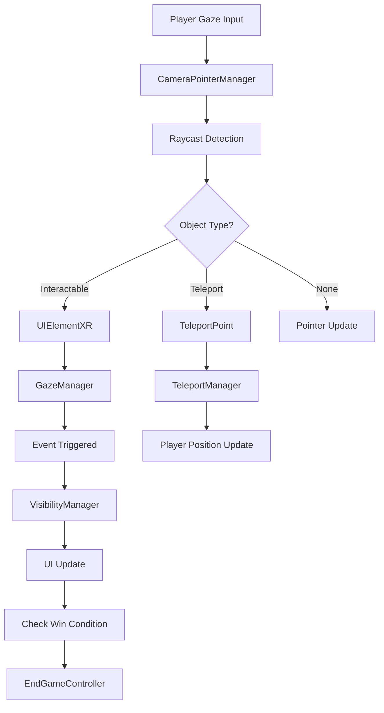
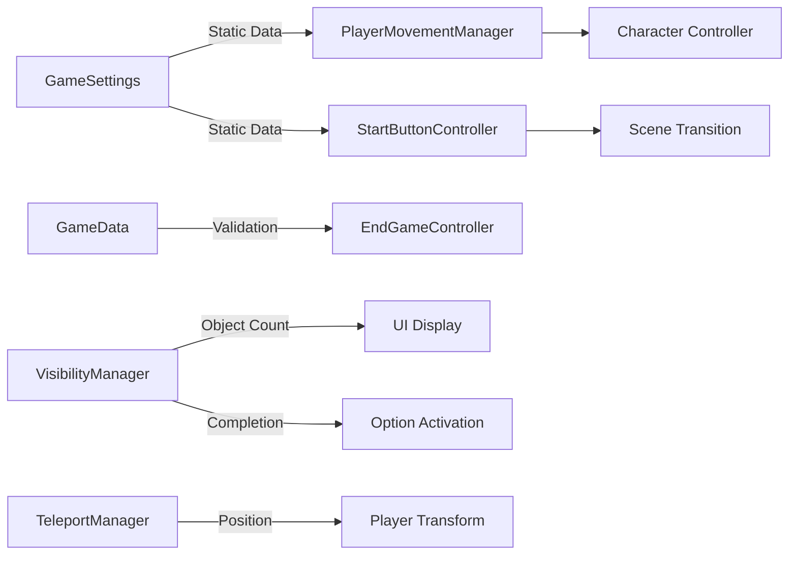

# Architecture Documentation - CalabozoVR

## 🏛️ System Overview

CalabozoVR employs a modular architecture designed specifically for VR applications, emphasizing performance, maintainability, and user experience. The system is built around Unity's component-based architecture with custom VR interaction patterns.

## 📐 Architectural Principles

### Core Design Patterns

1. **Singleton Pattern**
   - Ensures single instances of critical managers
   - Used for: TeleportManager, CameraPointerManager, GazeManager

2. **Observer Pattern**
   - Event-driven communication between components
   - Decouples UI updates from game logic

3. **Component Pattern**
   - Unity's native component system
   - Modular, reusable behaviors

4. **State Management**
   - Static classes for global state
   - Scene-specific state in MonoBehaviour components

## 🗂️ System Architecture

```
┌─────────────────────────────────────────────────────────────┐
│                     CalabozoVR Architecture                │
├─────────────────────────────────────────────────────────────┤
│  Presentation Layer                                         │
│  ┌─────────────┐ ┌─────────────┐ ┌─────────────┐          │
│  │ Main Menu   │ │ Game Scene  │ │ End Game    │          │
│  │ UI          │ │ UI          │ │ UI          │          │
│  └─────────────┘ └─────────────┘ └─────────────┘          │
├─────────────────────────────────────────────────────────────┤
│  Interaction Layer                                          │
│  ┌─────────────┐ ┌─────────────┐ ┌─────────────┐          │
│  │ Gaze System │ │ UI Elements │ │ Teleport    │          │
│  │ (VR Input)  │ │ XR          │ │ Points      │          │
│  └─────────────┘ └─────────────┘ └─────────────┘          │
├─────────────────────────────────────────────────────────────┤
│  Game Logic Layer                                           │
│  ┌─────────────┐ ┌─────────────┐ ┌─────────────┐          │
│  │ Game Data   │ │ Game        │ │ Visibility  │          │
│  │ Management  │ │ Settings    │ │ Manager     │          │
│  └─────────────┘ └─────────────┘ └─────────────┘          │
├─────────────────────────────────────────────────────────────┤
│  Locomotion Layer                                           │
│  ┌─────────────┐ ┌─────────────┐ ┌─────────────┐          │
│  │ VR Look     │ │ Teleport    │ │ Camera      │          │
│  │ Walk        │ │ Manager     │ │ Pointer     │          │
│  └─────────────┘ └─────────────┘ └─────────────┘          │
├─────────────────────────────────────────────────────────────┤
│  VR Foundation Layer                                        │
│  ┌─────────────┐ ┌─────────────┐ ┌─────────────┐          │
│  │ Google      │ │ Unity XR    │ │ Cardboard   │          │
│  │ Cardboard   │ │ System      │ │ Simulator   │          │
│  └─────────────┘ └─────────────┘ └─────────────┘          │
└─────────────────────────────────────────────────────────────┘
```

## 🔄 Data Flow Architecture

### Primary Game Flow



### Data State Management



## 🧩 Component Architecture

### Core Manager Components

#### CameraPointerManager (Singleton)
```csharp
Responsibilities:
├── Raycast management
├── Object interaction detection  
├── Pointer visual feedback
├── Event coordination
└── VR input processing

Dependencies:
├── GazeManager (event subscription)
├── TeleportPoint (teleport events)
├── UIElementXR (interaction events)
└── Unity Physics System
```

#### TeleportManager (Singleton)
```csharp
Responsibilities:
├── Teleport point coordination
├── Player position management
├── Point activation/deactivation
└── Editor simulator updates

Dependencies:
├── Player Transform
├── TeleportPoint components
└── CardboardSimulator (editor only)
```

#### GazeManager (Singleton)
```csharp
Responsibilities:
├── Gaze timing management
├── Selection event triggering
├── Teleport event handling
└── Interaction state tracking

Dependencies:
├── CameraPointerManager (event subscription)
├── Timer management
└── Event delegation system
```

### Game Logic Components

#### GameData (Static)
```csharp
Responsibilities:
├── Answer validation
├── Game state constants
└── Win condition logic

Data Structure:
├── CorrectAnswer: string
└── IsCorrectAnswer(): bool
```

#### GameSettings (Static)
```csharp
Responsibilities:
├── Global configuration storage
├── Player preference management
└── Cross-scene data persistence

Data Structure:
├── PlayerSpeed: float
└── PlayerTeleportationActivated: bool
```

#### VisibilityManager
```csharp
Responsibilities:
├── Object discovery tracking
├── Progress UI updates
├── Win condition triggering
└── Option activation

State Management:
├── totalObjects: int (3)
├── hiddenObjectCount: int
└── UI references: GameObject[]
```

### UI and Interaction Components

#### UIElementXR
```csharp
Responsibilities:
├── VR-specific UI interactions
├── Material state management
├── Object visibility control
└── Event system integration

Features:
├── Gaze enter/exit events
├── Click event handling
├── Material feedback
└── VisibilityManager integration
```

#### EndGameController
```csharp
Responsibilities:
├── Game completion handling
├── Player positioning
├── Movement state control
└── Result display

Workflow:
├── Animation state monitoring
├── Menu activation/deactivation
├── Player constraint management
└── Status text updates
```

### Movement and Locomotion

#### VRLookWalk (PlayerMovementManager)
```csharp
Responsibilities:
├── Head-tilt movement detection
├── Teleportation mode switching
├── Character controller integration
└── Settings synchronization

Movement Logic:
├── Angle threshold detection (30°)
├── Forward direction calculation
├── Speed application from GameSettings
└── Teleportation mode handling
```

## 🔗 Dependency Graph

### High-Level Dependencies

```
Scene Management
├── MainMenuComponent → SceneManager
├── StartButtonController → GameSettings → Scene Transition
└── EndGameController → Player Management

Interaction Chain
├── CameraPointerManager → GazeManager → UIElementXR
├── UIElementXR → VisibilityManager → UI Updates
└── TeleportManager → Player Transform → Position Updates

Data Flow
├── GameSettings → VRLookWalk → CharacterController
├── GameData → EndGameController → UI Display
└── VisibilityManager → Option Activation → Game Completion
```

### Component Coupling Analysis

**Low Coupling (Good)**
- GameData ↔ EndGameController
- GameSettings ↔ StartButtonController  
- TeleportManager ↔ TeleportPoint

**Medium Coupling (Acceptable)**
- CameraPointerManager ↔ GazeManager
- UIElementXR ↔ VisibilityManager

**High Coupling (Needs Monitoring)**
- EndGameController ↔ Multiple Player Components
- CameraPointerManager ↔ Multiple Interaction Systems

## 🎯 Design Decisions & Rationale

### Singleton Pattern Usage

**Decision**: Use Singletons for core managers
**Rationale**: 
- Ensures single source of truth for VR interactions
- Simplifies access from multiple components
- Prevents duplicate raycast operations
- Maintains consistent state across scenes

**Implementation**:
```csharp
public static CameraPointerManager Instance;

private void Awake() 
{
    if (Instance != null && Instance != this) {
        Destroy(gameObject);
    } else {
        Instance = this;
    }
}
```

### Static Classes for Settings

**Decision**: Use static classes for GameSettings and GameData
**Rationale**:
- Persist data across scene transitions
- Global accessibility without instance management
- Simplified configuration system
- No need for complex state management

### Event-Driven Interaction

**Decision**: Use Unity Events and delegates for VR interactions
**Rationale**:
- Decouples input detection from response logic
- Allows multiple components to respond to single interaction
- Maintains Unity's component-based architecture
- Enables easy debugging and monitoring

### Component-Based UI

**Decision**: Create VR-specific UI components (UIElementXR)
**Rationale**:
- Adapts standard UI patterns to VR requirements
- Maintains Unity's UI event system compatibility
- Provides consistent VR interaction patterns
- Enables reusable VR UI elements

## 🔄 State Management

### Global State (Cross-Scene)

```csharp
GameSettings (Static)
├── PlayerSpeed
├── PlayerTeleportationActivated
└── [Persists across scenes]

GameData (Static)  
├── CorrectAnswer
├── IsCorrectAnswer()
└── [Game rules and validation]
```

### Scene-Specific State

```csharp
VisibilityManager (Instance)
├── hiddenObjectCount
├── totalObjects
└── UI references

TeleportManager (Singleton)
├── lastTeleportPoint
├── Player reference
└── Point states

CameraPointerManager (Singleton)
├── _gazedAtObject
├── hitPoint
└── Interaction state
```

### State Transitions

```
Menu Scene → Game Scene
├── GameSettings applied to VRLookWalk
├── TeleportManager initialized
└── CameraPointerManager activated

Game Scene → End Game
├── VisibilityManager triggers completion
├── EndGameController activates
└── Player movement controlled

End Game → Menu Scene  
├── GameSettings maintained
├── Scene transition via SceneManager
└── State reset for new game
```

## 🚀 Performance Considerations

### Raycast Optimization

**Current Implementation**:
- Raycast performed every Update()
- Maximum distance: 10 units
- Layer-based filtering for performance

**Optimization Opportunities**:
```csharp
// Consider implementing
private float raycastInterval = 0.1f; // 10 FPS raycast rate
private float lastRaycastTime;

void Update() {
    if (Time.time - lastRaycastTime > raycastInterval) {
        PerformRaycast();
        lastRaycastTime = Time.time;
    }
}
```

### Memory Management

**Singleton Lifecycle**:
- Properly destroyed on scene transitions
- Avoid memory leaks with instance checks
- Consider DontDestroyOnLoad for persistent managers

**Object Pooling Opportunities**:
- Pointer visual elements
- UI feedback components
- Audio source pooling for 3D sound

### VR-Specific Optimizations

**Frame Rate Maintenance**:
- Target 60 FPS for comfort
- Minimize Update() operations
- Use coroutines for non-critical updates

**Rendering Optimizations**:
- Occlusion culling enabled
- LOD system for complex objects
- Texture compression for mobile VR

## 🔮 Future Architecture Enhancements

### Recommended Improvements

1. **Event System Refactor**
   ```csharp
   public static class GameEvents {
       public static event Action<GameObject> OnObjectFound;
       public static event Action<string> OnAnswerSubmitted;
       public static event Action OnGameCompleted;
   }
   ```

2. **Configuration System**
   ```csharp
   [CreateAssetMenu(fileName = "GameConfig", menuName = "Game/Config")]
   public class GameConfiguration : ScriptableObject {
       public string[] correctAnswers;
       public float[] speedOptions;
       public float raycastDistance;
   }
   ```

3. **State Machine Implementation**
   ```csharp
   public enum GameState {
       Menu, Playing, Paused, Completed
   }
   
   public class GameStateMachine : MonoBehaviour {
       public GameState CurrentState { get; private set; }
       public void ChangeState(GameState newState) { /* Implementation */ }
   }
   ```

4. **Dependency Injection**
   ```csharp
   public interface IVisibilityManager {
       void ChangeVisibility(GameObject obj);
   }
   
   public class UIElementXR : MonoBehaviour {
       [Inject] private IVisibilityManager visibilityManager;
   }
   ```

This architecture provides a solid foundation for VR development while maintaining flexibility for future enhancements and optimizations.